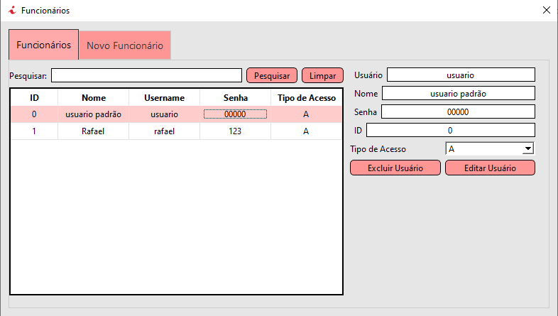

# Estoque-Venda-DrogariasCIn
## Sobre esse Projeto
 Aplicação Desktop  para sistema de vendas e manutenção de estoque de fármacia desenvolvido em C++ com uso do framework QT-Creator.

## Como executar
1. Clique no link e faça download do instalador compartilhado: [Clique-Aqui](https://drive.google.com/file/d/1VNh5rtsxHLf2OI56S3VXrIPkXUsTZu2S/view?usp=sharing);
2. Execute o instalador;
3. Acesse o arquivo gerado;
4. procure pelo arquivo 'Projeto_OOP.exe' e pronto, agora é só executá-lo.

## Tecnologias Utilizadas
- QtCreator
- C++
- SQlLite

## Equipe de desenvolvimento
- Bruno Henrique(bhfp)
- Rafael Sales(rcqss)

## Imagens do Sistema

### Tela de Login

### Quadro de funcionários

### Tela de vendas

### Tela do histórico de vendas

